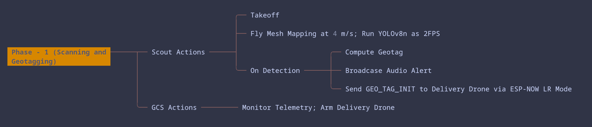

# Agenda and Current status 

## Team Composition

| Sl NO | Name | Department |
| --------------- | --------------- | --------------- |
| 1 | Sinchan K N | Avionics and propulsion |
| 2 | Vaishnav Sabari girish | Avionics and Navigation |
| 3 | Spoorti Hannikeri | Propulsion |
| 4 | Dhruv Bhandari | Structure |
| 5 | Madaka Rakshita | Navigation |
| 6 | Huzaifa Afzal | Structure and Payload |
| 7 | Moiz Arsiwala | Payload |
| 8 | Rishikesh Bitla | Avionics and Payload |
| 9 | Manasvi Ravi | Navigation |
| 10 | Vrishank S C | Control |

<!--end_slide-->

## Mission Objective 

Locate and deliver survival kits to 10 stranded survivors in a flooded coastal town within 30 minutes.

## Mission Requirements

- Scan area, detect survivors , geotag locations and communicate via speaker.
- Deliver 10 survival kits (each 200 g) with <1.5 m accuracy from 20 ft altitude.
- Both drones must operate from a single command station (manual mode incurs penalty).

## Design Requirements

- Weight per drone: <= 25kg
- Launch area: 6×6 ft
- De-licensed frequencies only (e.g., 2.4 GHz, 5.8 GHz, 868 MHz)
- Mandatory fail-safes: Return-to-home (RTH) for link loss, low battery, geofence breach, altitude breach

<!--end_slide-->

## Concept of Operation 

### Pre-Mission 

<!--end_slide-->

### Phase 1 

<!--end_slide-->

### Phase 2 

<!--end_slide-->

### Phase 3

<!--end_slide-->

# Our Progress

1. Preliminary CAD design.
2. Initial communication tests.
3. Yolo tests
4. Preliminary weight estimation
5. Preliminary Payload dropping mechanism design
6. Sponsor Mapping

<!--end_slide-->

# Timeline

